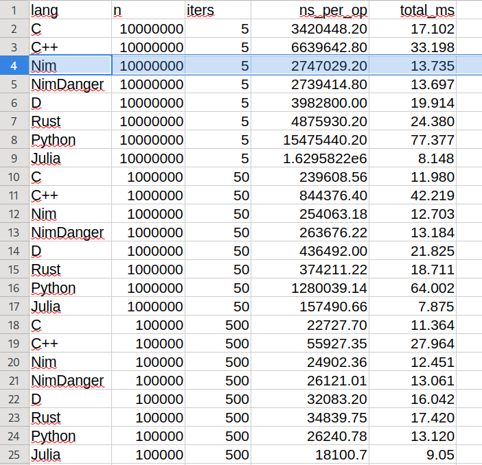

# Benchmark: Maximum Odd Number from a Binary String

This repository contains a comprehensive benchmark comparing the execution speed of **C, C++, D, Rust, Nim, Python, and Julia** on a memory- and CPU-bound string manipulation task. The goal is to compare compiler code-generation quality, memory handling, and runtime overheads across different programming paradigms.

## 🧩 The Problem
Given a binary string, rearrange its bits to form the **maximum possible number** that is **odd** (the last bit must be `1`).

**Edge cases verified:** 
`1011` → `1101` | `100000` → `000001` | `111` → `111` | `10` → `01`


## Results

<p align="center">
  
</p>


### The Algorithm (O(n))
1. Count the number of `1`s (`ones`) and `0`s (`zeros`).
2. Construct the result: `(ones - 1)` ones, followed by all `zeros`, followed by a single `1`.

This guarantees the maximum possible value for a fixed set of bits under the constraint that the last bit is `1`. The implementations across all languages are logically identical to ensure we are comparing **compiler/interpreter efficiency**, not algorithmic differences.

## 📂 Project Structure
```text
.
├── gen_data.py          # Deterministic test data generator (seed=42)
├── build.sh             # Compiles C, C++, Nim, D, and Rust
├── run_bench.sh         # Executes all binaries/scripts and logs results
├── src/                 # Source code for all languages
│   ├── bench_c.c
│   ├── bench_cpp.cpp
│   ├── bench_d.d
│   ├── bench_rust.rs
│   ├── bench_nim.nim
│   ├── bench_julia.jl
│   └── bench_python.py
├── data/                # Generated input files (len_10.txt to len_10000000.txt)
└── results/             # Output CSV and performance charts
    ├── results.csv
    └── Results.png
